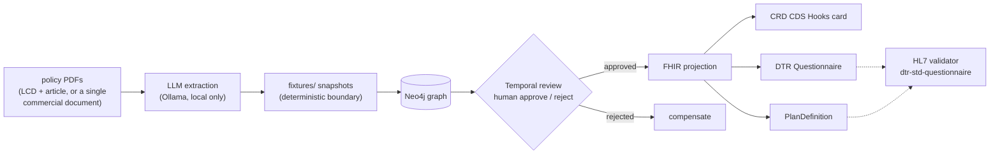
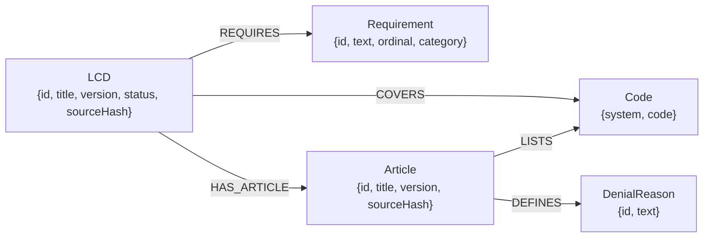

# pa-fhir-poc

A proof of concept that turns payer coverage-policy PDFs — Medicare Local
Coverage Determinations (LCDs) and commercial policies alike — into Da Vinci
CRD/DTR FHIR artifacts, with a durable human-gated review between extraction
and publication. Built as a public reference for Da Vinci Project members:
it demonstrates the shape of a prior-authorization pipeline end to end — not
a production service.

Three policies are the demonstration fixtures: Medicare LCDs L33822
(Glucose Monitors, article A52464) and L33718 (PAP Devices for Obstructive
Sleep Apnea, article A52467), plus Cigna Medical Coverage Policy 0158
(Surgical Treatments for Obstructive Sleep Apnea) — a single-document
commercial policy handled through a per-publisher dialect profile. The
second LCD was added exactly as [add another policy](#8-add-another-policy)
prescribes — a fixtures-only change, no document-specific code; the Cigna
policy cost one dialect profile in `src/extract/dialects/` and nothing
downstream of extraction.



The LLM extraction is the only non-deterministic stage, and it is quarantined
behind a snapshot: everything downstream is a pure function of its inputs.
The Temporal workflow blocks indefinitely on a human signal — that block is
the governance feature, not a hang. Nothing reaches FHIR without a named
reviewer's approval, recorded on the graph.

## 1. See the output without running anything

The artifacts projected from each reviewed graph are committed as
[`docs/examples/`](docs/examples/), for both demonstration LCDs (a policy
that states no documentation requirements — e.g. the CIGNA-0158 third
fixture — projects no DTR Questionnaire, because `dtr-std-questionnaire`
requires at least one item; see
[`docs/conformance/CIGNA-0158.md`](docs/conformance/CIGNA-0158.md)):

- [`L33822.dtr.json`](docs/examples/L33822.dtr.json) /
  [`L33718.dtr.json`](docs/examples/L33718.dtr.json) — DTR Questionnaire, one
  boolean attestation item per documentation requirement.
- [`L33822.crd.json`](docs/examples/L33822.crd.json) /
  [`L33718.crd.json`](docs/examples/L33718.crd.json) — CRD CDS Hooks card:
  covered HCPCS codes plus the requirement text a clinician would see.
- [`L33822.plandefinition.json`](docs/examples/L33822.plandefinition.json) /
  [`L33718.plandefinition.json`](docs/examples/L33718.plandefinition.json) —
  PlanDefinition linking each covered code to the questionnaire.
- [`CIGNA-0158.crd.json`](docs/examples/CIGNA-0158.crd.json) /
  [`CIGNA-0158.plandefinition.json`](docs/examples/CIGNA-0158.plandefinition.json)
  — the commercial-payer third fixture (single-document Cigna dialect):
  CPT + HCPCS covered codes; no Questionnaire, because the policy states no
  documentation requirements.

## 2. What's proven vs. deliberately deferred

**Proven**, on three real policies from two publishers — MAC LCD/article
pairs (L33822 + A52464, L33718 + A52467) and a commercial single-document
policy (CIGNA-0158):

- The full PDF → graph → governed-review → FHIR chain, including the
  workflow's indefinite block on the human signal.
- **Generality within a publisher**: the second pair (PAP devices —
  different clinical domain, 1 article-listed ICD-10 code where glucose
  monitoring has 461) went through as a fixtures-only change. It also did
  exactly what a second document should: it exposed two generic pipeline
  defects (PDF line-wrap fragments masquerading as section headings;
  "covered codes" harvested from prose), both fixed for all documents with
  regression tests — see
  [`docs/conformance/L33718.md`](docs/conformance/L33718.md).
- **Generality across publishers**: CIGNA-0158 is a structurally different
  document — no companion article, zero ICD-10 codes, and CPT/HCPCS code
  tables whose headings *are* the coverage stances. It went in as a
  per-publisher **dialect profile** (`src/extract/dialects/`, sniffed from
  the PDF's page-1 banner and cross-checked against the filename) plus
  fixtures; everything downstream of extraction consumes the same
  payer-neutral shapes and was untouched. Denial reasons come out of the
  stance-stratified tables deterministically — no LLM. Design:
  [`docs/superpowers/specs/2026-08-22-payer-dialect-seam-design.md`](docs/superpowers/specs/2026-08-22-payer-dialect-seam-design.md).
- **Honest projection over convenient output**: CIGNA-0158 states no
  documentation requirements, so it projects **no** DTR Questionnaire —
  `dtr-std-questionnaire` requires `item` 1..*, and fabricating one to fill
  the slot would be inventing policy. The CRD card says "coverage criteria
  apply" with no questionnaire link, and `validate` reports the absence as
  an explained skip:
  [`docs/conformance/CIGNA-0158.md`](docs/conformance/CIGNA-0158.md).
- **IG conformance by the official HL7 validator** (M6), for both LCDs: each
  DTR Questionnaire validates against the DTR IG v2.2.0
  `dtr-std-questionnaire` StructureDefinition with **0 errors, 0 warnings**;
  each PlanDefinition against base R4 with 0 errors. CIGNA-0158's
  PlanDefinition likewise passes base R4 with 0 errors. Full reports, flags,
  and rationale: [`docs/conformance/`](docs/conformance/).
- Correct absence of profiles where none exist: the CRD CDS Hooks card is a
  logical model under CRD v2.2.1 (not a FHIR resource), and no Da Vinci
  CRD/DTR profile exists for PlanDefinition. Both are verified findings, not
  oversights.

**Deliberately deferred** (see [`docs/backlog.md`](docs/backlog.md)):

- Executable CQL — the questionnaire's `library` reference is a stub
  canonical.
- A live CDS Hooks service — nothing serves the `/cds-services` endpoint an
  EHR would call.
- Terminology validation — the validator runs `-tx n/a`; HCPCS and ICD-10-CM
  aren't freely distributable as FHIR CodeSystem content.
- An in-process Zod conformance guardrail (fhir-zod-gen) — seam designed,
  blocked on upstream tooling.

## 3. Graph model



`Article` is its own node because ICD-10 codes and denial reasons are
asserted by the policy article, not the LCD — each fact lives on the document
that states it. `Code` is a single label with a composite key on
`(system, code)`: HCPCS and ICD-10 are the same kind of thing, and FHIR
models every coded value as `{system, code}`, so a unified node projects
straight through. Review provenance (`lastReviewDecision`, `lastReviewer`,
`lastReviewNote`) lands on the LCD node; only an `approved` LCD may project —
projecting a draft throws.

## 4. Prerequisites

- Node >= 22.18 (type stripping runs TypeScript unbuilt, no build step)
- Docker, for the Neo4j container (and the optional conformance validator)
- Temporal CLI, for `temporal server start-dev` (or a namespace on a shared
  Temporal — see Setup)
- Ollama running locally with the model named by `EXTRACTION_MODEL`
  (default `qwen3.8:27b`) pulled
- The MAC source PDFs: `fixtures/L33822.pdf` + `fixtures/A52464.pdf`, and
  (for the second pair) `fixtures/L33718.pdf` + `fixtures/A52467.pdf` —
  each LCD with its paired policy article. These are "Create PDF" exports
  from the Medicare Coverage Database (MCD), a dynamic search UI — they
  cannot be fetched programmatically and are not redistributed in this
  repository. Every stage that needs them fails loudly with the exact path
  it expected if they are absent.
- **Third fixture (CIGNA-0158, single-document dialect):** unlike the
  public-domain CMS documents above, Cigna's coverage policy is copyrighted,
  so `fixtures/CIGNA-0158.pdf` is deliberately not committed. Fetch it with
  `./tools/fetch-cigna-0158.sh`, then run it through the same pipeline with
  no article argument: `node cli.ts run fixtures/CIGNA-0158.pdf`. If the PDF
  is absent, `npm test`'s acceptance gate skips that LCD's ground-truth test
  with an explanatory message rather than failing.

## 5. Setup

```bash
npm install
cp .env.example .env
docker compose up -d
temporal server start-dev
```

A fresh clone's `.env` points `TEMPORAL_NAMESPACE` at `default`, which
`temporal server start-dev` provides. If a Temporal server already occupies
`:7233` on your machine, don't start a second one — create a dedicated
namespace on the existing one instead and point `.env` at it:

```bash
temporal operator namespace create pa-fhir-poc
```

then set `TEMPORAL_NAMESPACE=pa-fhir-poc` in `.env`.

## 6. Run the full chain

Three terminals.

**Terminal A** — start the review worker (blocks; leave it running):

```bash
node src/workflow/worker.ts
```

**Terminal B** — run the full chain on the demonstration fixtures:

```bash
node cli.ts run fixtures/L33822.pdf fixtures/A52464.pdf
```

(General form: `node cli.ts run <policy.pdf> [article.pdf]` — the article is
required for MAC LCDs and rejected for single-document Cigna policies, per
the sniffed dialect.)

This extracts both PDFs, starts the review workflow (whose first activity
loads the graph), prints the workflow id, and then blocks. That block is the
durable human gate — the point of the design, not a hang. Nothing projects
until a human signs off.

**Terminal C** — approve the review:

```bash
node cli.ts review-signal review-L33822 approve <your-name>
```

Terminal B then unblocks, projects the approved LCD, and writes
`out/L33822.crd.json`, `out/L33822.dtr.json`, and
`out/L33822.plandefinition.json`.

For finer-grained control, run each stage as its own verb instead of `run`:

```bash
node cli.ts extract fixtures/L33822.pdf
node cli.ts extract-article fixtures/A52464.pdf
node cli.ts load L33822 A52464
node cli.ts review-start L33822 A52464
node cli.ts review-signal <workflowId> approve <your-name>
node cli.ts project L33822
```

Prefer a browser over Terminals B and C? Start the review console
(Terminal A's worker still required) and open http://127.0.0.1:8006 —
upload the LCD/article PDF pair, watch extraction and review phases
advance, approve or reject with a note, and download the projected
artifacts:

```bash
node src/ui/server.ts    # blocks; run from the repo root in its own terminal
```

## 7. Validate conformance (optional — M6)

The committed evidence in [`docs/conformance/L33822.md`](docs/conformance/L33822.md)
already shows the verdicts; nothing below is required to use the repo. To
reproduce them with the official HL7 validator (Docker runs it — no local
Java needed):

```bash
./tools/fetch-validator.sh     # once; downloads the pinned validator_cli.jar
node cli.ts validate L33822
```

The first run downloads the DTR IG package tree into `.fhir/` (gitignored);
later runs are offline. The Questionnaire is validated against
`dtr-std-questionnaire` from `hl7.fhir.us.davinci-dtr#2.2.0`, the
PlanDefinition against base R4, and the CRD card is reported as skipped with
the reason (it is a CDS Hooks logical model, not a FHIR resource).

## 8. Add another policy

The pipeline has no document-specific code. What a new policy costs depends
on whether its publisher's format is already known:

**Same publisher format (a new MAC LCD, another Cigna policy) — fixtures
only.** This is not just a claim: L33718/A52467 was added this way — see
[`docs/conformance/L33718.md`](docs/conformance/L33718.md).

1. Place the policy PDF at `fixtures/<policyId>.pdf`, and its paired article
   PDF alongside it if the dialect uses one (MAC does; Cigna does not).
2. Hand-author `fixtures/<policyId>.expected.json` describing the acceptance
   bar for extraction (requirement count, category distribution, key
   phrases).
3. Run the same commands from "Run the full chain" or the granular verbs,
   substituting the new paths and ids — including `validate <policyId>` if
   you want the conformance verdict.

No file under `src/` or `cli.ts` changes.

**A new publisher format — one dialect profile.** A dialect covers a
publisher's *format*, not a plan or a document: one for all MAC
LCDs/articles, one for all Cigna coverage policies. A payer whose documents
are shaped differently needs a new profile in `src/extract/dialects/`
(banner pattern for sniffing, section headings, code-table layout, whether
an article is expected) — plus the fixtures above. That is the honest,
deliberate cost of the design; CIGNA-0158 is the worked example, and
nothing downstream of extraction changed to accommodate it.

## 9. Testing

```bash
npm test
npm run typecheck
```

`npm test` includes M1's acceptance gate, which runs the live extraction
model against every `fixtures/*.expected.json` — several minutes per policy,
so expect the full suite to take a while. Any policy whose PDF is absent is
skipped with a message naming the path (and, for fetch-gated fixtures like
CIGNA-0158, the script that retrieves it) rather than failing. Graph- and
Temporal-backed tests need `docker compose up -d` and a reachable Temporal
server, per Setup above. The validator is deliberately **not** part of
`npm test` — its deterministic surface is tested, but no test needs Docker,
Java, or the network.

## 10. Repository tour

- `src/extract/` — PDF → text → sections → LLM → `Requirement[]`; the only
  Ollama-aware file is `llm-client.ts`, and `dialects/` holds the
  per-publisher format knowledge (MAC, Cigna) sniffed from each document
- `src/ui/` — the review console (§6): upload, watch extraction and review
  phases, approve/reject with a note, download artifacts
- `src/graph/` — schema/constraints, upsert, approved-subgraph read,
  validation report
- `src/workflow/` — Temporal review workflow, activities, worker, client
- `src/fhir/` — the three artifact builders, `profiles.ts` (sole home of
  every canonical URL), `validate.ts` (M6 runner)
- `cli.ts` — the single orchestration entrypoint for every verb above
- `docs/examples/` — committed artifacts; `docs/conformance/` — validator
  evidence; `docs/backlog.md` — deliberate deferrals; `docs/plans/` —
  per-milestone implementation plans
- `PA-AI-POC-PLAN.md` — the original scope and milestone plan

## 11. License

[MIT](LICENSE).
